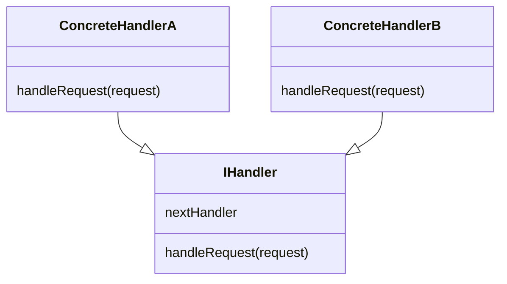
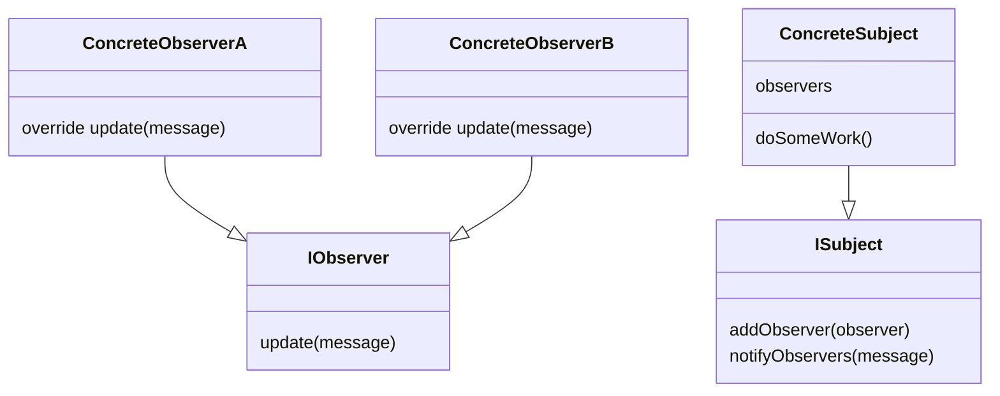
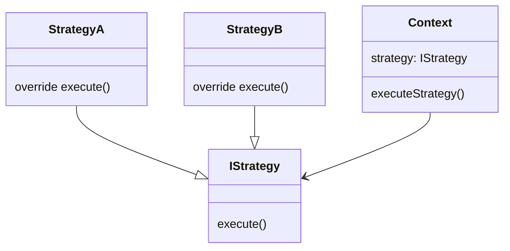

# Behavioral Patterns

Behavioral patterns are about communication and responsibility between objects.

---

## Chain of Responsibility

Pass a request along a chain of handlers. Each handler decides to process it or forward it.

**When to use:** Log level filtering, middleware pipelines, approval workflows.

**LLD example:** Logging framework — DEBUG handler passes to INFO, INFO to WARNING, etc.



```kotlin
fun handleRequest(request: String) {
    if (request == "A") println("handled")
    else nextHandler?.handleRequest(request)
}
```

> Key: each handler holds a reference to the next. The chain is assembled at runtime — easy to extend without modifying handlers.

---

## Observer

One-to-many dependency: when a subject changes state, all registered observers are notified automatically.

**When to use:** Event systems, pub-sub, UI data binding, stock price alerts.

**LLD example:** Pub-Sub system, Stock Brokerage System (price change → notify subscribers).



```kotlin
fun doSomeWork() {
    // do work...
    notifyObservers(message)
}
fun notifyObservers(message: String) {
    observers.forEach { it.update(message) }
}
```

> Observer vs Pub-Sub: Observer is synchronous, direct coupling between subject and observers. Pub-Sub adds a broker in between (decoupled, async).

---

## Strategy

Define a family of algorithms, encapsulate each one, and make them interchangeable without affecting the client.

**When to use:** Sorting strategies, payment methods, discount rules, restaurant selection.

**LLD example:** Food ordering — `LowestPriceSelectionStrategy` vs other selection strategies.



```kotlin
class Context(private val strategy: IStrategy) {
    fun executeStrategy() = strategy.execute()
}
```

> Strategy enables OCP — adding a new algorithm means adding a new class, not modifying the context.
