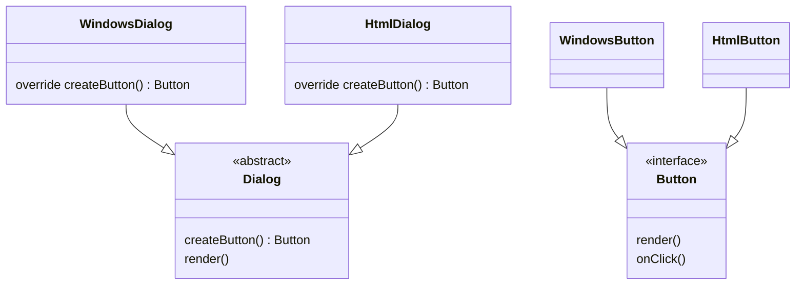
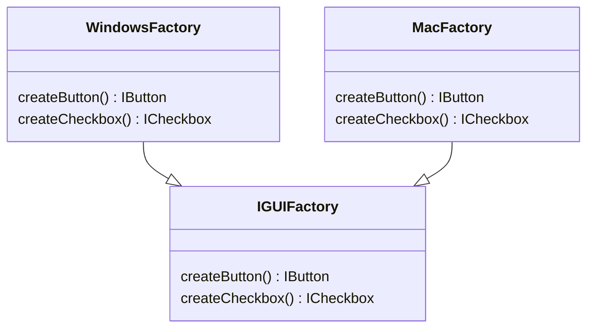
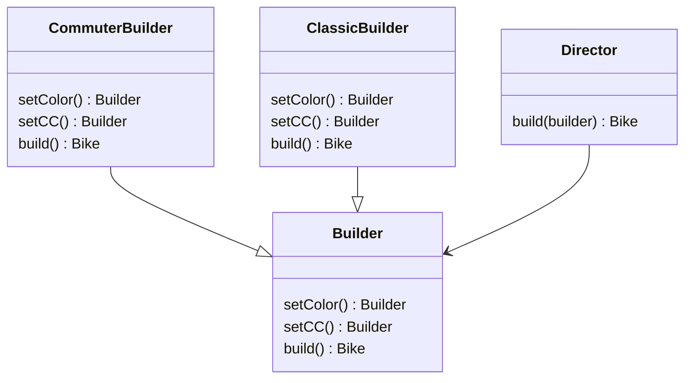

# Creational Patterns

Creational patterns abstract the object creation process, making systems independent of how objects are created.

---

## Singleton

Ensures a class has only one instance and provides a global access point to it.

**When to use:** Logger, config manager, thread pool, DB connection pool.

**LLD example:** Logging framework — single `Logger` instance shared across the app.

```kotlin
class Singleton {
    companion object {
        private val instance = Singleton()
        fun getInstance() = instance
    }
}

// Thread-safe lazy singleton with dependency
class Config private constructor(val env: String) {
    companion object {
        @Volatile private var instance: Config? = null
        fun getInstance(env: String) = instance ?: synchronized(this) {
            instance ?: Config(env).also { instance = it }
        }
    }
}
```

> Use `@Volatile` + double-checked locking for thread safety. In Kotlin, `object` keyword gives you a Singleton for free.

---

## Factory Method

Define an interface for creating an object, but let subclasses decide which class to instantiate.

**When to use:** When the exact type to create isn't known until runtime; when subclasses should control what they create.

**LLD example:** UI framework — `WindowsDialog` creates `WindowsButton`, `HtmlDialog` creates `HtmlButton`.



```kotlin
abstract class Dialog {
    abstract fun createButton(): Button
    fun render() {
        val button = createButton()
        button.onClick("open")
        button.render("new")
    }
}
class WindowsDialog : Dialog() {
    override fun createButton(): Button = WindowsButton()
}
```

> Factory Method = Template Method applied to object creation. The parent defines *when* to create; subclasses decide *what* to create.

---

## Abstract Factory

Produce families of related objects without specifying concrete classes.

**When to use:** When you need to ensure that created objects are compatible with each other (e.g. UI theme — all buttons, checkboxes, and inputs must match the same OS style).

**Difference from Factory Method:** Factory Method creates one product; Abstract Factory creates a *suite* of related products.



---

## Builder

Construct complex objects step by step. The same construction process can produce different representations.

**When to use:** Objects with many optional parameters; when you want to avoid telescoping constructors.

**LLD example:** Building `Bike` (commuter vs classic) with different color/CC combinations.



```kotlin
class Director {
    fun build(builder: Builder): Bike = builder.setCC().setColor().build()
}

// usage
val commuter = Director().build(CommuterBuilder())
val classic   = Director().build(ClassicBuilder())
```

> Director is optional — callers can call builder steps directly for custom configurations. In Kotlin, data class `copy()` and named parameters often replace Builder for simple cases.
