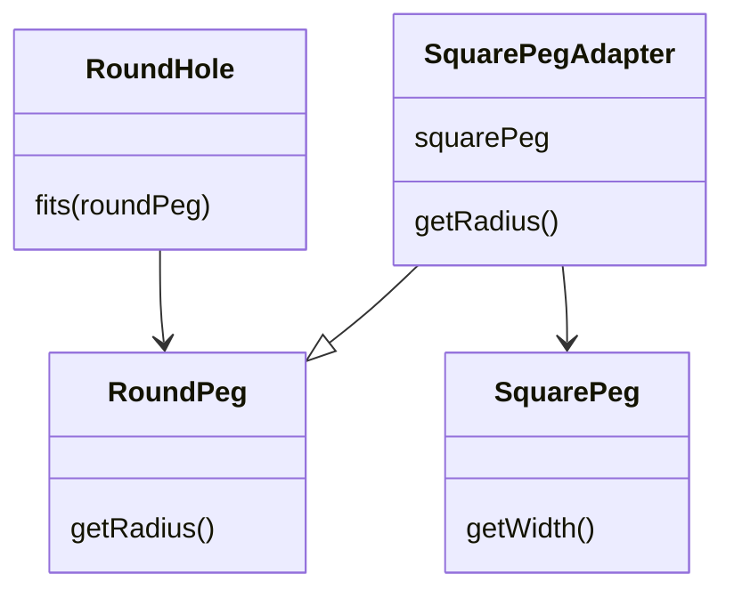
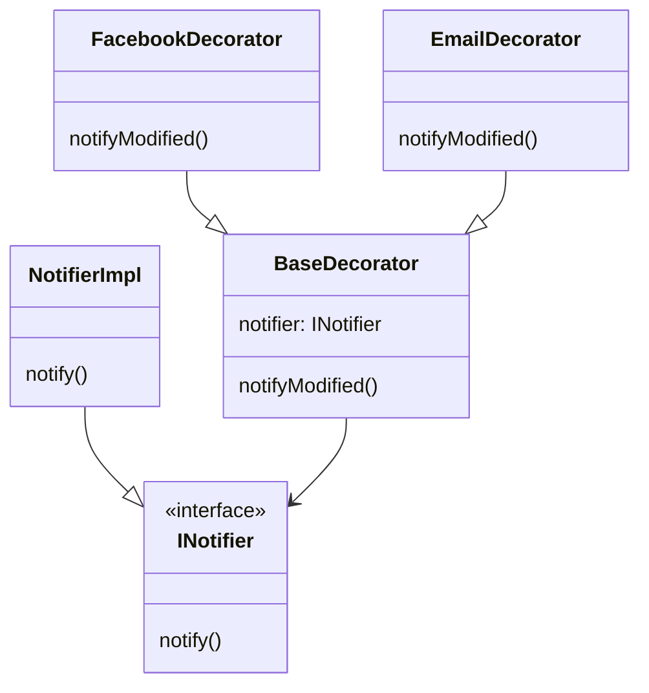
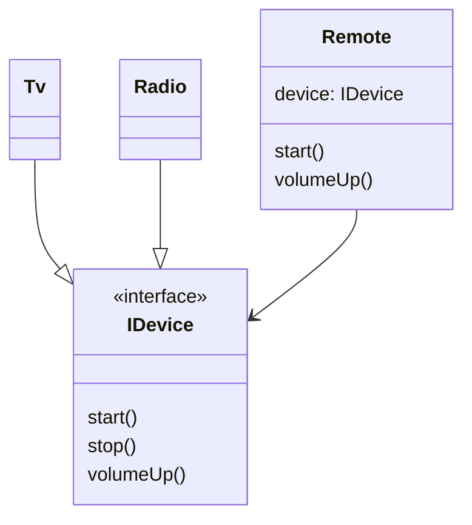
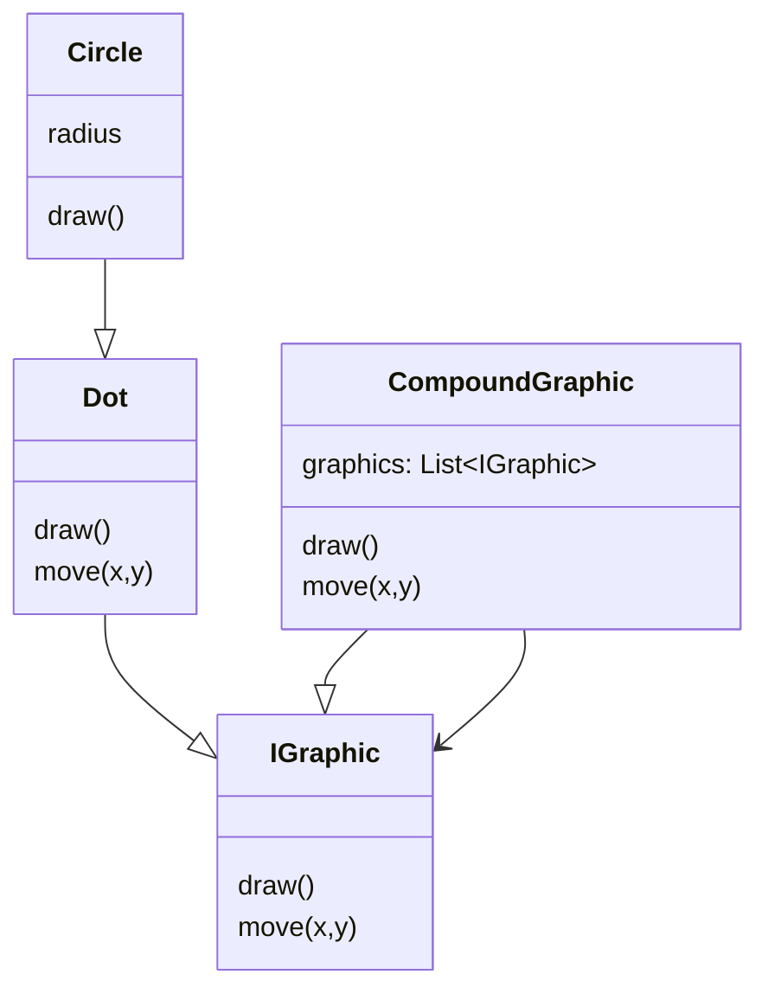

# Structural Patterns

Structural patterns explain how to assemble objects and classes into larger structures while keeping them flexible and efficient.

---

## Adapter

Allows objects with incompatible interfaces to collaborate by wrapping one inside an adapter.

**When to use:** Integrating a third-party library with a different interface; legacy code migration.

**LLD example:** Wrapping a `SquarePeg` to fit a `RoundHole` API.



```kotlin
class SquarePegAdapter(private val squarePeg: SquarePeg) : RoundPeg(squarePeg.getWidth() / 2)

// now fits() works with a square peg via the adapter
roundHole.fits(SquarePegAdapter(squarePeg))
```

> Adapter wraps an existing object. Decorator also wraps, but its purpose is to *add behaviour*, not fix an incompatible interface.

---

## Decorator

Attach additional behaviour to objects dynamically by wrapping them in decorator objects.

**When to use:** Adding features to objects without subclassing; stackable behaviours (e.g. multiple notification channels).

**LLD example:** `NotifierImpl` → wrap with `FacebookDecorator` → wrap with `EmailDecorator`.



```kotlin
val base = NotifierImpl()
FacebookDecorator(base).notifyModified()  // base + Facebook
EmailDecorator(base).notifyModified()     // base + Email
// stack them: EmailDecorator(FacebookDecorator(base))
```

> Decorator vs Inheritance: Decorator adds behaviour at *runtime*; inheritance adds it at *compile time*. Decorator composes; inheritance couples.

---

## Bridge

Split a large class (or set of closely related classes) into two separate hierarchies — abstraction and implementation — that can vary independently.

**When to use:** When you want to avoid a combinatorial explosion of subclasses (e.g. `TvRemote`, `RadioRemote`, `SmartTvRemote`…).

**LLD example:** `Remote` (abstraction) works with any `IDevice` (implementation — Tv, Radio) without cross-subclassing.



```kotlin
class Remote(val device: IDevice) {
    fun volumeUp() = device.volumeUp()
}
// mix freely: Remote(Tv()), Remote(Radio())
```

> Bridge = composition over inheritance for two varying dimensions. If you find yourself writing `ConcreteAConcreteB` subclass names, Bridge is the fix.

---

## Composite

Compose objects into tree structures. Treat individual objects and compositions uniformly.

**When to use:** File system (file vs folder), UI component trees, organisational hierarchies.

**LLD example:** `CompoundGraphic` contains `Dot` and `Circle` objects — `draw()` on the compound draws all children.



```kotlin
val group = CompoundGraphic(mutableListOf(Dot(1,2), Circle(3,4,5)))
group.draw()   // draws all children — caller doesn't know or care about the tree depth
group.move(1,1)
```

> The key insight: `CompoundGraphic` implements the same `IGraphic` interface as its children. Client code never needs to distinguish leaf vs composite.

---

## Facade

Provide a simplified interface to a complex subsystem.

**When to use:** Wrapping a complex library/framework so callers don't need to know the internals.

**LLD example:** A `HomeTheaterFacade` that orchestrates Projector, Amplifier, DvdPlayer with a single `watchMovie()` call.

```kotlin
class HomeTheaterFacade(
    private val projector: Projector,
    private val amp: Amplifier,
    private val dvd: DvdPlayer
) {
    fun watchMovie(movie: String) {
        projector.on()
        amp.setVolume(10)
        dvd.play(movie)
    }
    fun endMovie() {
        dvd.stop()
        amp.off()
        projector.off()
    }
}
```

> Facade doesn't prevent direct access to subsystem components — it just provides a convenient shortcut.
