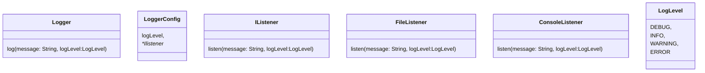

### Splitwise
- done

### Logging framework 

1. The logging framework should support different log levels, such as DEBUG, INFO, WARNING, ERROR, and FATAL.
2. It should allow logging messages with a timestamp, log level, and message content.
3. The framework should support multiple output destinations, such as console, file, and database.
4. It should provide a configuration mechanism to set the log level and output destination.
5. The logging framework should be thread-safe to handle concurrent logging from multiple threads.
6. It should be extensible to accommodate new log levels and output destinations in the future.

#### Solution self


#### Learning
- interface for logger
- data class for message
- 

### PubSub
1. The Pub-Sub system should allow publishers to publish messages to specific topics.
2. Subscribers should be able to subscribe to topics of interest and receive messages published to those topics.
3. The system should support multiple publishers and subscribers.
4. Messages should be delivered to all subscribers of a topic in real-time.
5. The system should handle concurrent access and ensure thread safety.
6. The Pub-Sub system should be scalable and efficient in terms of message delivery.

#### Solution self
```
classDiagram
    class Publisher(broker){
        topic
        publish(message){
            broker.produce(message, topic)
        }
    }
    class Consumer{
        consume()
    }
    class Broker{
        topics
        subscribe(topic,consumer)
        produce(message, topic){
            topic.subscriber.forEach{
                it.consume(message)
            }
        }

    }
    class Topic{
        name,
        list~pusblisher~,
        list~consumer~
    }
```

#### Learning
```
class Topic{
    name
    subscribers
    subscribe()
    unsubscribe()
    publish()
}
class Pubisher(topics){
    produce(message, topic){
        topics[topic].publish()
    }
}
class Subscriber{
    notify()
}
```

### LRU Cache
1. The LRU cache should support the following operations:
- put(key, value): Insert a key-value pair into the cache. If the cache is at capacity, remove the least recently used item before inserting the new item.
- get(key): Get the value associated with the given key. If the key exists in the cache, move it to the front of the cache (most recently used) and return its value. If the key does not exist, return -1.
2. The cache should have a fixed capacity, specified during initialization.
3. The cache should be thread-safe, allowing concurrent access from multiple threads.
4. The cache should be efficient in terms of time complexity for both put and get operations, ideally O(1).


#### Solution self
```
class LRUCache{
    map<string, dequeue> mp
    DeQueue<pair<string,string>> qu
    capacity
    put(key,value){
    
    }
    get(key, value)
}
```

### Car Rental
1. The car rental system should allow customers to browse and reserve available cars for specific dates.
2. Each car should have details such as make, model, year, license plate number, and rental price per day.
3. Customers should be able to search for cars based on various criteria, such as car type, price range, and availability.
4. The system should handle reservations, including creating, modifying, and canceling reservations.
5. The system should keep track of the availability of cars and update their status accordingly.
6. The system should handle customer information, including name, contact details, and driver's license information.
7. The system should handle payment processing for reservations.
8. The system should be able to handle concurrent reservations and ensure data consistency.

#### Solution self
```
browse
reserve
modifyReservation
cancelReservation

Car - make, model,type, year, licensePlate, priceperDay, quantity
Reservation - user, car, status(booked, completed, canceled), startEndDate, completedDate

```