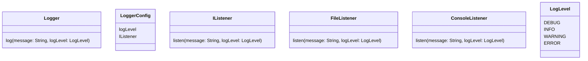

# Logging Framework — Practice Notes

## Requirements (from memory)

1. Support log levels: DEBUG, INFO, WARNING, ERROR, FATAL
2. Log messages with timestamp, log level, and message content
3. Support multiple output destinations: console, file, database
4. Configurable log level and output destination
5. Thread-safe for concurrent logging
6. Extensible for new log levels and destinations

## Solution sketch

## Learnings

- Use an interface for the listener (Chain of Responsibility / Observer)
- Use a data class for the log message
- `LoggerConfig` holds the active log level — filter in the logger before dispatching
