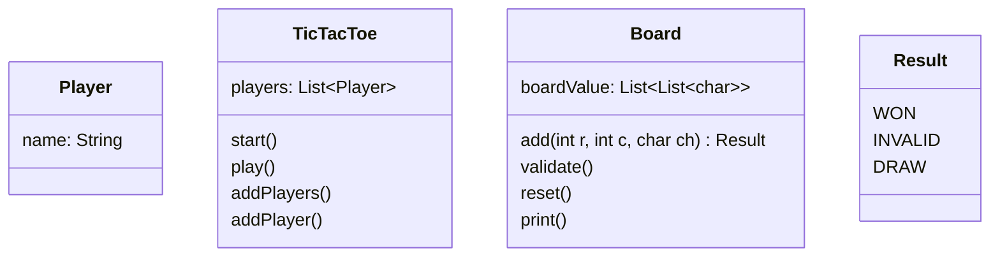

### Requirements

1. The Tic-Tac-Toe game should be played on a 3x3 grid.
2. Two players take turns marking their symbols (X or O) on the grid.
3. The first player to get three of their symbols in a row (horizontally, vertically, or diagonally) wins the game.
4. If all the cells on the grid are filled and no player has won, the game ends in a draw.
5. The game should have a user interface to display the grid and allow players to make their moves.
6. The game should handle player turns and validate moves to ensure they are legal.
7. The game should detect and announce the winner or a draw at the end of the game.

### UML Solution

#### Self

Game Sample Console

```markdown
Let`s Play
Enter Player 1 name: 
Vikash
Enter Player 2 name:
Tom
Player 1, enter your move(row, column):
0,0,X
Player 2, enter your move(row, column):
0,0,O
This is not allowed
Player 1 wins
```



Pseudo code

```kotlin
fun start(){
    println("Let`s play")
    addPlayers()
    play()
}
fun play(){
    while(true){
        if(!handleMove(players[0]))break
        if(!handleMove(players[1]))break
    }
}
fun handleMove(name: String): Boolean{
    while(true){
        println("Player $name, enter your move(row, column):")
        val input = readLine()
        // add a new method which takes string as input and returns three char values
        val result = board.add(input)
        if(result == WON){
            println("Player $name wins")
            return false
        }
        else if(result == INVALID){
            println("This is not allowed")
            continue
        }
        else if(result == DRAW){
            println("Match Drawn!")
            return false
        }
        return true
    }
}
```
